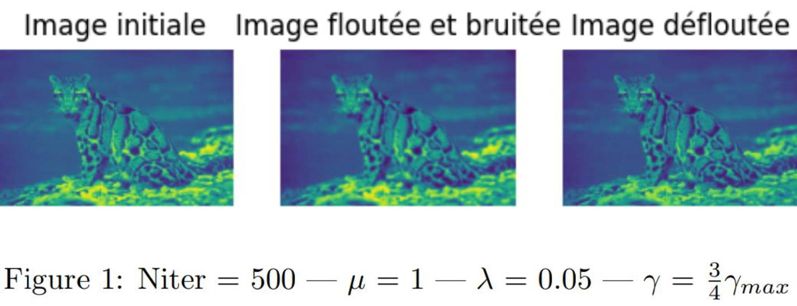

# Variation-Totale
Résolution de problème inverse en utilisant la méthode des directions alternées de multiplicateurs (ADMM) en Python pour minimiser une fonction de cout afin de reconstituer une image ( cf le compte rendu joint pour une explication détaillée )

## Objectif

La méthode de variation totale est utilisée principalement pour la restauration d'images et la résolution de problèmes inverses dans divers domaines tels que le traitement d'images et la vision par ordinateur. Le but principal de cette méthode est de préserver les bords tout en éliminant le bruit dans les images. 

En termes techniques, elle cherche à minimiser la variation totale de l'image, ce qui correspond à la somme des gradients de l'image sur tout son domaine. Cette minimisation aide à lisser l'image en réduisant les variations mineures de l'intensité des pixels tout en maintenant les discontinuités nettes, telles que les bords des objets, ce qui est souvent crucial pour obtenir une image visuellement agréable ou pour préparer l'image pour des traitements ultérieurs.

En résumé, la méthode de variation totale est efficace pour éliminer le bruit tout en conservant les structures importantes de l'image, comme les contours, ce qui la rend particulièrement utile dans les applications où la précision des contours est critique.

## Méthode ADMM
Dans le cadre de la méthode ADMM, la particularité est que la fonction de cout à minimiser que nous voyons ci-dessous contient un opérateur flou H dans son terme d'attache aux données rendant obsolète la technique du calcul en passant par le Dual.

L’Alternated Direction Method of Multipliers consiste à séparer problème difficile à résoudre en deux sous problèmes plus faciles à calculer.
Ainsi, on introduit une variable auxiliaire dans le problème primal et on utilise des techniques comme l’ADMM pour traiter la contrainte. On pose donc : y = Dx

Pour pouvoir réduire cette fonction de coût, on va adopter une stratégie de minimisation alternée. Autrement dit, à chaque itération, on fixe la valeur de `y` et on minimise par rapport à `x`, puis inversement. Ainsi, selon la méthode de l'ADMM, on obtient le système d’équation suivant :

Pour pouvoir réduire cette fonction de coût, on va adopter une stratégie de minimisation alternée. Autrement dit, à chaque itération, on fixe la valeur de `y` et on minimise par rapport à `x`, puis inversement. Ainsi, selon la méthode de l'ADMM, on obtient le système d’équation suivant :

- E(x, y) = ||Hx - z||^2 + λ||y||_1 + (µ/2)||y - Dx||^2
- x^(k+1) = arg min_{x ∈ R^N} E(x, y^k)
- y^(k+1) = arg min_{y ∈ R^2N} E(x^(k+1), y)

## Résultats
On a au départ seulement l'image floutée et bruitée et on arrive après l'algo à obtenir une image défloutée qui ressemble beacoup à l'image initiale.

